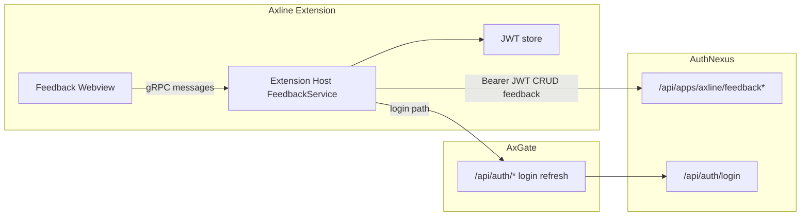

# Axline × AuthNexus Feedback Hub — 客户端需求与实施方案

> **Status**: Implementing (Phase A0+A1 in progress)  
> **Version**: 0.2.1  
> **Updated**: 2026-07-17  
> **Audience**: Axline 开发、AuthNexus / AxGate / Cobyte 联调、第三方审核  
> **Scope**: **仅 Axline 侧**（VS Code 扩展客户端）。AuthNexus Hub API/控制台、Cobyte 实施、Axlinker 评审见配套文档，不在本文实现范围内。  
> **Related**: AuthNexus Hub `plan/user-feedback-hub.md` **v0.2.0**（契约权威）；Account [`specs/axgate-account-integration.md`](../specs/axgate-account-integration.md)（含 AUTH-02 Feedback 例外）；评审 [`AuthNexus reviews/feedback-hub-axline-third-party-review-2026-07-17.md`](file:///d:/ai_workspace/AuthNexus/.agent/project/reviews/feedback-hub-axline-third-party-review-2026-07-17.md)

---

## 1. 文档目的

将 **Axline** 定为 Feedback Hub 的**第一个对接目标应用**。本文给出：

1. Axline 产品需求（用户能做什么）；
2. 与 AuthNexus 的边界（Axline 不实现什么）；
3. 客户端架构与 UI 方案；
4. 分阶段交付与验收标准；
5. 风险、开放问题与审核检查清单。

第三方审核时请重点评估：**职责边界是否清晰、鉴权是否与现有 AxGate Account 一致、VS Code 形态是否合理、MVP 是否可狗粮**。

---

## 2. 背景与定位

| 项 | 内容 |
|----|------|
| 产品 | Axline（`axline.axline`）— Cline fork，私有 VSIX 分发 |
| 形态 | **VS Code / Cursor 扩展** → 反馈 UI = **扩展内 Webview 面板/视图**（非独立桌面窗、非独立网站） |
| Auth appId | AuthNexus 独立应用 **`axline`**（与 AxGate Console 的 `axgate` 分离，见 Account 规格 OQ-01） |
| 当前版本基线 | VSIX **0.2.8** released（AuthNexus STABLE） |
| Hub 权威源 | 用户可见反馈状态以 **AuthNexus Feedback Hub** 为准 |
| Axline 角色 | **客户端壳**：提交、列表、详情、评论、状态只读展示；**不**跑 AI triage、**不**下达实施指令、**不**合 PR |

端到端价值链（Axline 只负责左侧客户端）：

```text
Axline 用户提交/查看
    → AuthNexus Feedback Hub（存储 + 管理台 + Webhook）
        → Cobyte（AI 分析 / 实施，经 AxGate LLM）
            → Gitea PR → Axlinker（评审合入）
                → AuthNexus Software Release → Axline 私有更新（既有能力）
```

---

## 3. 范围边界

### 3.1 Axline 必须做（In Scope）

| ID | 需求 | 优先级 |
|----|------|--------|
| AX-F-01 | 已登录用户可提交反馈（类型：Bug / Feature / Question；标题 + 正文） | P0 |
| AX-F-02 | 提交时支持粘贴/选择 **图片 + 日志/文档附件**（png/jpeg/webp/gif/pdf/txt/md/log/json/csv/xml/docx），多文件，单文件 ≤ **10 MB**，受 Hub 侧大小/MIME 限制 | P0 |
| AX-F-03 | 提交时强制附带 **非敏感客户端上下文**（见 §6.4，8 项必填不可取消）；New 表单展示提交账号 | P0 |
| AX-F-04 | **我的反馈**列表：状态、标题、更新时间；可打开详情 | P0 |
| AX-F-05 | **本应用公共反馈**列表（Hub 上 `visibility=PUBLIC` 且属于 `axline` app） | P0 |
| AX-F-06 | 详情页：状态时间线感、评论列表；**作者**可评论任意可见单；**本 app ACTIVE 成员**可评论 **PUBLIC** 单（「我也遇到」属此能力，MVP 即允许，无需单独 P1）；展示 `externalPrUrl` / `releaseVersion` 若有；附件仅经 Hub **鉴权下载 API** 加载 | P0 |
| AX-F-07 | 未登录时引导登录（复用 AxGate Account 登录流），禁止匿名提交 MVP | P0 |
| AX-F-08 | 命令面板入口：`Axline: Feedback` / `Axline: Report Issue`；设置 About 区入口 | P0 |
| AX-F-09 | 网络/401/403 错误可读提示；401 走既有 refresh→重试→deauth，**403 不登出** | P0 |
| AX-F-10 | 配置 Feedback API Base（默认与 AuthNexus 基址对齐，可经 `endpoints.json`） | P0 |
| AX-F-11 | 单元/集成级：API client mock 测试；webview 关键组件 smoke | P1 |
| AX-F-12 | 文档：用户如何反馈；联调手册；与 Account/私有更新的依赖说明 | P1 |

### 3.2 Axline 明确不做（Out of Scope）

| 项 | 归属 |
|----|------|
| Feedback 数据模型、状态机、管理审核 UI、`dispatch implement` | AuthNexus |
| AI 初评、多轮 AI 讨论写回、自动实施开发 | Cobyte（+ AxGate LLM） |
| PR 评审、合入、沙箱 CI | Axlinker + Gitea |
| VSIX 发版管道本身 | 既有 AuthNexus Software + Axline `release-private-vsix` |
| 在扩展内嵌入 LLM 做本地 triage | 不做（避免与 Hub/Cobyte 双轨） |
| 投票/路线图/看板拖拽等 Canny 重度功能 | 二期再议 |
| 匿名/未开通 `axline` 成员的提交 | MVP 不做 |

### 3.3 对 AuthNexus 的依赖（前置契约，非本文实现）

Axline MVP **阻塞依赖** AuthNexus Hub **v0.2.0+** 契约（见 Hub plan §3），至少：

1. `POST/GET /api/apps/:appId/feedback`（业务 id `axline` 或 UUID）
2. 详情 `by-number/:number` 或等价；`POST .../comments`；multipart 创建
3. **鉴权附件下载** `GET .../attachments/:attachmentId`（禁止依赖公开 `/uploads`）
4. User JWT：`appId` claim 匹配 + ACTIVE；mine / public；不可见 PRIVATE → **404**
5. 冻结 OpenAPI：字段、`page/limit` 分页、413/415/401/403 codes、状态枚举与转移（客户端只读展示）

若 Hub 未就绪，Axline 可先完成 **UI + `FeedbackClient` 抽象 + mock**，不得对真实用户开放「假成功」提交。

---

## 4. 用户故事（GitHub Issues 类比）

| 角色 | 故事 | 验收要点 |
|------|------|----------|
| 开发者 | 在 IDE 内一键报 Bug，附截图与版本信息 | 提交后列表可见；详情状态为 OPEN/TRIAGING 等 |
| 开发者 | 查看自己历史反馈进展 | Mine 列表过滤；状态与评论刷新 |
| 开发者 | 浏览团队已公开的需求/问题，避免重复提 | Public 列表；可打开详情；ACTIVE 成员可评论 PUBLIC 单 |
| 开发者 | 在讨论中补充信息 | 详情内发评论成功 |
| 未登录用户 | 点击 Feedback 被引导登录 | 不出现空提交成功 |
| 管理员 | （不在 Axline）在 AuthNexus 应用 Feedback 目录审核 | Axline 仅只读看到状态变化 |

---

## 5. UX / UI 方案

### 5.1 呈现形态（锁定）

- **主形态**：VS Code **Webview**（侧栏子视图或主侧栏内嵌路由页面），与 Chat/Settings 同技术栈（React + Vite webview-ui）。
- **入口**：
  1. Command：`Axline: Open Feedback`、`Axline: Report Issue`（后者直达新建表单）
  2. Settings → About / Help：`Send Feedback`
  3. （可选 P1）Activity Bar 次级图标或 Account 页入口
- **不做**：独立 Electron 窗、系统浏览器强制跳转（允许「在浏览器打开 AuthNexus 详情」作降级，P2）。

### 5.2 信息架构

```text
Feedback
├── New（Report）
│   ├── type: Bug | Feature | Question
│   ├── title / body
│   ├── attachments (images)
│   └── client context checklist (auto-filled)
├── Mine
├── Public (this app)
└── Detail /:number
    ├── status badge + timestamps
    ├── body + images
    ├── comments timeline
    └── external links (PR / release) if present
```

交互对标 GitHub Issues：**列表 → 详情 → 评论**；状态以 badge 展示，用户**不能**在 Axline 内把状态改为 Implementing/Done（只读）。

### 5.3 视觉与实现约束

- 复用现有 webview 设计语言（Cline/Axline tokens），避免另起一套营销落地页。
- **Webview 不得 import `@cline/core`**（既有 `check-webview-boundary`）；Feedback API 调用放在 **extension host**，webview 只经 gRPC/本地消息传展示数据与用户输入。
- JWT **不出 extension host**（与 Account 规格一致）：webview 永不持有 Bearer token。

---

## 6. 客户端架构方案

### 6.1 鉴权与调用路径（锁定默认）

| 决策 | 结论 | 理由 |
|------|------|------|
| 登录 | **复用 AxGate Account BFF**（`appId=axline`），不新增平行登录 | 已有规格与实现路径 |
| Feedback API 调用 | **Extension host 直连 AuthNexus Feedback REST**（User JWT） | Feedback 权威在 AuthNexus；避免 MVP 扩大 AxGate BFF 面；**Account AUTH-02 已决议本例外**（见 Account 规格修订） |
| Token | 使用当前会话 JWT（与 LLM/Account 同源存储策略） | 同一用户主体 |
| 基址配置 | **单源**：复用私有更新已有 AuthNexus 基址键（`authnexusBaseUrl` / endpoints 同源字段），禁止另立第二套漂移配置（R-7） | 运维一致 |
| **SEC（生产）** | `authnexusBaseUrl` **必须 HTTPS**（对齐 Account SEC-03）；开发可用 HTTP localhost | 评审 F-4 |
| **A0 联调前提** | 确认 AuthNexus 对 IDE 客户端网络 **HTTPS 可达**；失败则将 AxGate `/api/feedback/*` 反代升级为**默认**（不拖到 A2；MVP 不并行预建反代） | 评审 F-4 / OQ-N3 |



**降级（条件默认）**：A0 可达性验证失败 → AxGate `/api/feedback/*` 反代成为默认路径（属 AxGate 变更）。`FeedbackClient` **必须**可切换 base URL，UI 不感知。验证成功则保持直连，**不**并行建设反代。

### 6.2 模块落点（建议）

| 层 | 建议路径 | 职责 |
|----|----------|------|
| Host API client | `apps/vscode/src/services/feedback/` 或 SDK 旁独立 `feedback/` | REST、分页、上传、错误映射 |
| Controller | `apps/vscode/src/core/controller/feedback/` | 消息处理、登录门闸 |
| Webview UI | `apps/vscode/webview-ui/src/components/feedback/` | New / Mine / Public / Detail |
| Commands | `package.json` contributes.commands | 入口注册 |
| Config | `endpoints.example.json` 增补 feedback/authnexus 基址说明 | 本地不提交密钥 |

定制逻辑尽量集中，降低与 Cline upstream 合并冲突（同 Account 的 fork isolation 原则）。

### 6.3 API 使用约定（客户端视角）

假定 Hub 契约（字段名以 AuthNexus OpenAPI 最终版为准）：

| 操作 | 方法（示意） | 备注 |
|------|----------------|------|
| 创建 | `POST /api/apps/axline/feedback` multipart | `type,title,body,files[],clientContext` |
| 我的列表 | `GET .../feedback?scope=mine` | 分页 |
| 公共列表 | `GET .../feedback?scope=public` | 仅 PUBLIC |
| 详情 | `GET .../feedback/:id` 或 `.../by-number/:number` | 含 comments；附件 URL 仅为鉴权 API 路径 |
| 附件 | `GET .../attachments/:attachmentId` | Bearer；禁止使用 `/uploads/*` |
| 评论 | `POST .../feedback/:id/comments` | 正文纯文本（MVP） |

客户端须处理：429、413、415、409、401/403（`app_mismatch` / `not_member` / `insufficient_permission`）、不可见 **404**。附件加载走鉴权 API，不拼静态 URL。

### 6.4 自动附带的客户端上下文（非敏感）

全部 **必填**（UI 锁定；host `mergeRequiredFeedbackClientContext` 强制合并，webview 无法剥离）：

| 字段 | 示例 | 说明 |
|------|------|------|
| `axlineVersion` | `0.2.8` | package.json |
| `vscodeVersion` | `1.96.x` | `vscode.version` |
| `uiKind` | Desktop / Web | |
| `platform` | `win32` / `linux` / `darwin` | `process.platform` |
| `arch` | `x64` | |
| `appName` | Code / Cursor | `vscode.env.appName` |
| `language` | `zh-cn` | `vscode.env.language` |
| `extensionMode` | production / development | |

**用户身份**：不进 `clientContext`；由 JWT 写入 Hub `author`；New 表单只读展示 displayName/email。

**禁止自动上传**：workspace 绝对路径、文件内容、终端输出、JWT、API Key、`.env`、额外 PII（邮箱仅展示在「Submitting as」，不塞进 context blob）。

### 6.5 附件

- 来源：剪贴板粘贴、文件选择器；图片 + 日志/文档（png/jpeg/webp/gif/pdf/txt/md/log/json/csv/xml/docx，以 Hub 白名单为准）；单文件 ≤ 10 MB。
- 编码：multipart 经 host 上传；webview 只传本地临时路径或 bytes 句柄。
- **展示/下载**：仅请求 Hub 鉴权附件端点（Hub plan §3.5）；不得缓存或展示可匿名直链。
- 失败策略以 Hub API 为准；适配层须可测原子 multipart 创建。

---

## 7. 状态展示映射

| Hub status | 用户可见 |
|------------|----------|
| OPEN | Open |
| TRIAGING | Under review |
| NEEDS_INFO | Needs your reply |
| ACCEPTED | Accepted |
| QUEUED | Queued for work |
| IMPLEMENTING | In progress |
| IN_REVIEW | In review |
| DONE | Done / Shipped |
| REJECTED | Closed |
| DUPLICATE | Duplicate |

`NEEDS_INFO` 时详情页强调「请补充评论」。`DONE` 若带 `externalPrUrl` / release 版本，展示可点击链接。

---

## 8. 分阶段交付（仅 Axline）

### Phase A0 — 契约对齐（不发版）

- 对齐 AuthNexus Hub **v0.2.0** OpenAPI 草案（冻结后）
- 验证 AuthNexus 对客户端 **HTTPS 可达**；失败则启动 AxGate feedback 反代默认路径
- `axline` app 存在且测试用户 ACTIVE
- 冻结 `FeedbackClient` TypeScript 接口 + mock
- Cursor + VS Code 手工冒烟用例列入联调清单

### Phase A1 — MVP 狗粮（建议随 Axline minor，如 0.3.x）

- New / Mine / Public / Detail + 图片 + client context
- Command + About 入口
- 直连 AuthNexus；登录门闸
- 发布说明：依赖 AuthNexus Feedback API 最低版本

### Phase A2 — 体验加固

- 列表筛选/搜索
- 「从 Public 跟进」快捷评论
- 可选：浏览器打开控制台深链（admin 用）

### Phase A3 — 与发布闭环可见性

- 当 Hub 回写 `DONE` + release 版本时，详情展示「已在 vX.Y.Z 修复」+ Check for Updates 引导（复用私有更新）

---

## 9. 测试与验收

| 级别 | 内容 |
|------|------|
| 单测 | FeedbackClient：URL 构造、错误映射、context 序列化 |
| 组件 | 表单校验、未登录门闸、列表空态 |
| 手工 E2E | 登录 → 提交带图 → Mine 可见 → 控制台改状态（可无 Cobyte：OPEN→ACCEPTED→…）→ 扩展内刷新 → 评论 PUBLIC |
| 宿主 | VS Code 与 **Cursor** 各至少一次冒烟（OQ-3） |
| 代理 | 企业代理环境下提交/拉列表（R-6） |
| 回归 | `bun run build:sdk`；`apps/vscode` `check-types` / `check-webview-boundary` / `package` |
| 安全 | 抓包确认 webview 无 Authorization 头；附件非 `/uploads`；context 无路径/密钥 |

**狗粮 Definition of Done**：内部至少 3 名用户通过 Axline 提交真实反馈，并在 AuthNexus `axline` Feedback 目录可见；其中 1 条由**人工或 triage**推进到 `TRIAGING` **或** `ACCEPTED` 以上（不依赖 Cobyte 就绪）。

---

## 10. 风险与开放问题

| ID | 风险 / 问题 | 建议 |
|----|-------------|------|
| R-1 | AuthNexus Feedback API 未就绪导致 Axline 空转 | A0 契约优先；mock 开发并行 |
| R-2 | 直连 AuthNexus 与「Account 只走 AxGate」叙事不一致 | 文档明确「登录走 BFF、Feedback 资源走 Hub」；必要时 A2 加 BFF |
| R-3 | JWT audience/`appId` 导致 Feedback API 拒识 | 联调清单：用 `axline` 登录 token 打 Hub |
| R-4 | 公共看板泄露截图中的敏感信息 | 默认 visibility=PRIVATE；公开需 Hub 侧策略 |
| R-5 | Upstream Cline 合并冲突 | 代码落在隔离目录 `services/feedback` + `components/feedback` |
| R-6 | 企业代理 / TLS 中间人导致直连 AuthNexus 失败 | 尊重 VS Code `http.proxy` 与系统证书链；A0 增加代理环境用例 |
| R-7 | `axgateBaseUrl` + `authnexusBaseUrl` 双基址漂移 | **决议**：AuthNexus 基址与私有更新配置**单源**；文档与校验禁止分叉 |
| OQ-1 | Public 列表对 ACTIVE 默认可见？ | **Accept**（提交默认 PRIVATE） |
| OQ-2 | 投票/表情进 MVP？ | **Reject** |
| OQ-3 | Cursor 与 VS Code 同一入口？ | **Accept**（同一扩展；§9 含 Cursor 冒烟） |

---

## 11. 第三方审核检查清单（v0.1.0 评审结果）

| # | 项 | v0.1 判定 | v0.2 处置 |
|---|-----|-----------|-----------|
| 1 | §3 范围边界 | Pass | 保持 |
| 2 | §6.1 鉴权 vs Account | Pass with changes | AUTH-02 例外 + HTTPS + A0 可达性（F-4） |
| 3 | §5 UI / token | Pass | 保持 |
| 4 | §6.4 context | Pass | 保持 |
| 5 | §8 分期 / 狗粮 | Pass with changes | DoD 不依赖 Cobyte；对齐 Hub 人工全链 |
| 6 | §10 风险 | Pass with changes | 已增 R-6/R-7 |
| 7 | 接口期望 | Pass with changes | 依赖 Hub v0.2.0 §3 / OpenAPI |

复审时请对照 AuthNexus Hub **v0.2.0** 与 remediation 文档。

---

## 12. 参考

- Axline Account：`.agent/project/specs/axgate-account-integration.md`（AUTH-02 Feedback 例外）
- Axline 私有更新：`.agent/project/specs/axline-private-update.md`
- AuthNexus Hub：**v0.2.0** `.agent/project/plan/user-feedback-hub.md`
- 评审与修订对照：AuthNexus `.agent/project/reviews/feedback-hub-axline-third-party-review-2026-07-17.md`、`feedback-hub-axline-review-remediation-0.2.0.md`

---

## 13. Implementation notes (v0.2.1)

- Host: `apps/vscode/src/services/feedback/` + `core/controller/feedback/` + `proto/cline/feedback.proto`
- Webview: `webview-ui/src/components/feedback/`
- Config: single-source `authNexusBaseUrl` (HTTPS required); mock via `AXLINE_FEEDBACK_MOCK=1`
- A0 connectivity: see `sop/feedback-hub-a0-connectivity.md` — example AuthNexus URL is HTTP; HTTPS production gate not yet met (human decision for AxGate proxy)
- Working version bumped to **0.3.0** (developing); not released

*Version 0.2.1 — A0/A1 implementation started.*
