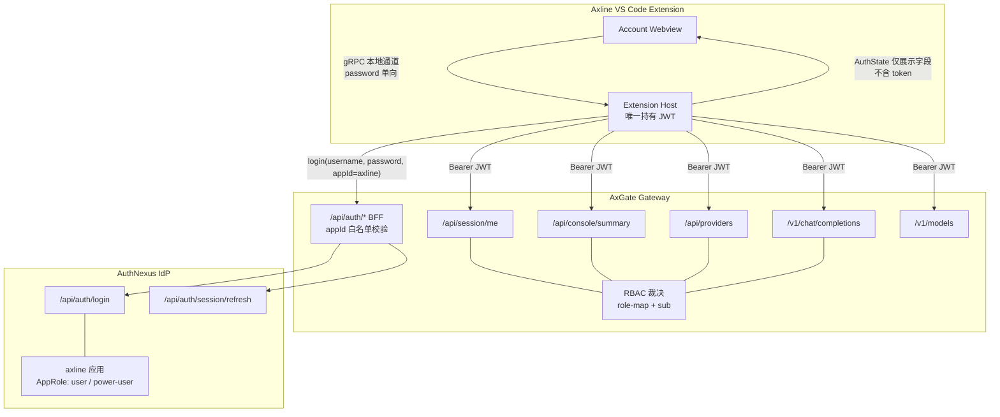
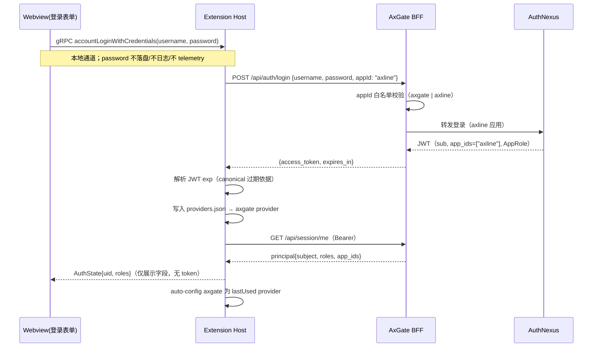
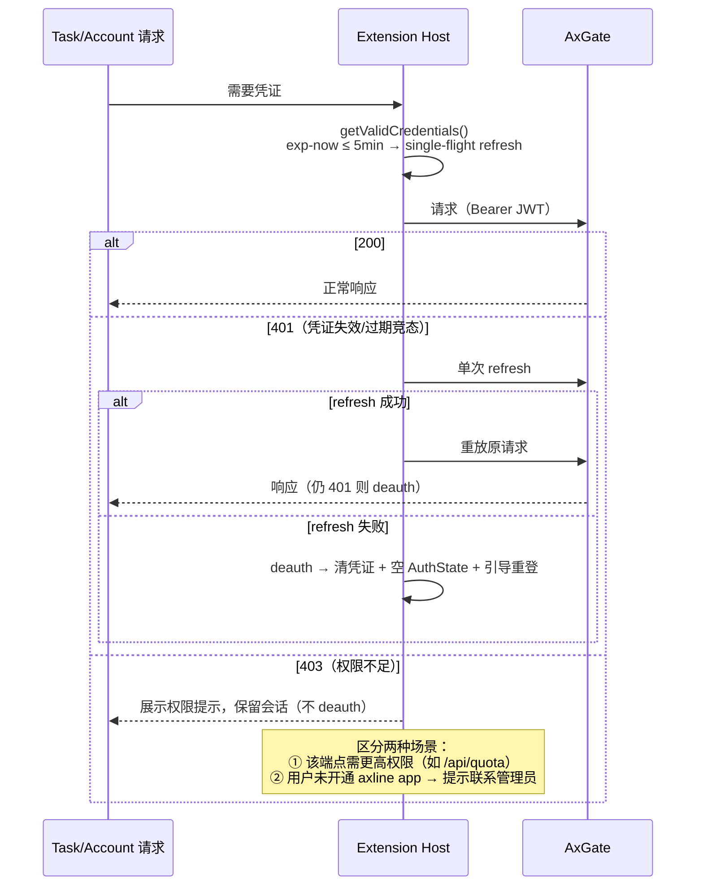

# Axline × AxGate 定制 Account 集成方案

> **Status**: Revised — 已吸收第三方评审全部 findings（[`reviews/axgate-account-integration-review.md`](reviews/axgate-account-integration-review.md)）  
> **Version**: 0.3.3 — Feedback Hub：AUTH-02 / 拓扑原则明确「Account+LLM 不得直连 AuthNexus；Feedback 资源 API 为已决议例外」  
> **Updated**: 2026-07-17  
> **Audience**: Axline 开发、AxGate / AuthNexus 联调、第三方审核  
> **Authority**: 本文件为 Axline 侧 Account 定制集成的 canonical 设计说明；AxGate 后端契约以 AxGate 仓库 living specs 为准。

---

## 1. 文档目的与范围

本文档描述 Axline（Cline VS Code fork）将 **Account 功能**从 Cline/WorkOS 体系**完全替换**为：

1. **AuthNexus**（`auth.mtsilicon.com`）用户名/密码登录，独立 `axline` 应用与 AppRole；
2. **AxGate** 作为统一 LLM 网关、鉴权 BFF 与 Account 数据 API；
3. Account 页展示用户身份、Provider 配置、Token/Quota 用量。

范围：认证 + Provider 配置 + 用量展示 + LLM 推理全链路，**完全替换** Cline Account（非并存）。

---

## 2. 关键决策

| 决策项 | 结论 | 依据 |
|--------|------|------|
| 登录方式 | 用户名 + 密码表单（后端为 AppRole 凭证式换 JWT） | 已确认 |
| Auth 入口 | **Account / LLM** 经 **AxGate BFF**，不直连 AuthNexus | 与 AxGate Console 同源 |
| Feedback 资源 API | **已决议例外**：Extension host 可直连 AuthNexus Feedback REST（见 [`plan/authnexus-feedback-client.md`](../plan/authnexus-feedback-client.md) §6.1）；生产 HTTPS | Feedback Hub 权威在 AuthNexus；避免无谓扩大 BFF；A0 不可达则改 AxGate 反代默认 |
| **Auth appId** | **独立注册 `axline`**（不复用 `axgate`） | 评审 OQ-01 决议：audience 隔离 + 角色封顶 + 独立吊销 + 审计归因 |
| appId 传递 | 客户端声明 + BFF 白名单校验 | 评审 F-5：双客户端共用 BFF，纯服务端注入无法区分来源 |
| 权限模型 | 客户端身份拆分，用户权限合并（AxGate 集中裁决） | 行业实践（OAuth2 多客户端 + 网关模式） |
| 401 / 403 语义 | 401 = 凭证问题（refresh→重试→deauth）；403 = 权限问题（提示，**不登出**） | 评审 F-1 / F-2 |
| Token 存储 | MVP 用 `providers.json`（短生命周期 JWT）；Phase 2 迁移 SecretStorage | 评审 OQ-02 |

---

## 3. 鉴权架构

### 3.1 系统上下文



### 3.2 设计原则

1. **Single gateway（Account + LLM）**：Axline 所有 **Account 与 LLM** 流量经 AxGate，用户不持有云厂商 API Key。客户端对 **登录/刷新/推理** 不感知 AuthNexus 拓扑。
2. **Feedback 例外**：用户反馈资源 API 以 AuthNexus Feedback Hub 为权威；允许 Extension host **直连** AuthNexus `/api/apps/{axline}/feedback*`（AUTH-02 例外）。生产 `authnexusBaseUrl` 必须 HTTPS。若 A0 验证客户端网络不可达 AuthNexus，则改为经 AxGate `/api/feedback/*` 反代（默认切换，非并行双轨）。
3. **客户端身份拆分**：Axline 在 AuthNexus 注册独立 `axline` app。JWT 的 appId/audience 标识签发来源，实现 audience 隔离、按客户端角色封顶、独立吊销、可信审计归因。
4. **用户权限合并**：provider 可见性、模型白名单、quota 挂在用户（`sub`）+ 角色上，由 AxGate 按 JWT claims 现场集中裁决；Axline 侧零权限配置。
5. **Token 不出 extension host**：JWT 仅存在于 extension host；webview 只收展示字段。
6. **Fail closed**：凭证失效阻止未授权推理；但 403（权限不足）不等于凭证失效，不触发登出。
7. **Fork isolation**：Axline 定制逻辑集中在 `apps/vscode/src/sdk/axgate/` 与 SDK `auth/axgate.ts`（及 `services/feedback/`），降低 Cline upstream 合并冲突。

### 3.3 身份与权限模型

**AuthNexus `axline` 应用**（部署前提 P-01）：

| 项 | 内容 |
|----|------|
| AppRole | `user`（默认档）；`power-user`（预留分档） |
| 用户开通 | 用户须被添加为 `axline` app 成员并赋予 AppRole，方可登录使用 |
| 角色独立性 | 同一用户在 `axgate` / `axline` 两 app 的 AppRole 相互独立 |

**AxGate role-map**（`config/authnexus-role-map.yaml`，按 appId 分段）：

| appId | AuthNexus AppRole | AxGate roles |
|-------|-------------------|--------------|
| `axgate`（Console，既有） | `owner`, `admin` | `ax_gate_admin`, `ax_gate_operator` |
| `axgate` | `editor` | `ax_gate_operator`, `ax_gate_caller` |
| `axgate` | `viewer`, `user` | `ax_gate_caller` |
| **`axline`（新增）** | `user` 及其余任意角色 | `ax_gate_caller`（**封顶，绝不映射 admin / operator**） |
| `axline` | `power-user`（预留） | `ax_gate_caller` + 未来分档角色 |

封顶效果：即使用户在 `axgate` app 为 admin，经 Axline 登录获得的 JWT 也只有 caller 能力——IDE token 泄露不波及 Console 管理面。

**权限关联链路**：登录 → JWT（`sub` + `app_ids=["axline"]` + AppRole）→ AxGate role-map 解析出 roles → 数据面按 roles（能见哪些 provider / 调哪些模型）+ `sub`（quota 归属 `project_id: ide-{subject}`）裁决。按用户差异化时优先用 `axline` AppRole 分档 + role-map 映射；不在 AxGate 侧按 `sub` 建 ACL（运维成本高）。

### 3.4 跨 app 用户关联契约

AxGate Console 用户（`appId=axgate`）与 Axline IDE 用户（`appId=axline`）通过 **AuthNexus 同一个全局用户主体**关联，不在 Axline 本地维护额外用户映射。

```text
同一个 AuthNexus 用户
  ├─ appId = axgate  → Console token → 管理/运营角色
  └─ appId = axline  → IDE token     → caller 封顶角色
```

**Canonical subject 规则**：

1. AuthNexus SHALL 在 `axgate` 与 `axline` 两个 app 签发的 JWT 中提供同一个全局稳定用户标识。
2. AxGate SHALL 使用该全局稳定用户标识作为 principal subject、quota subject、usage subject 与 audit subject。
3. 推荐优先级：`userId`（全局用户 ID） → `sub`（仅当 AuthNexus 保证跨 app 稳定） → `username/email`（仅临时兜底，不建议长期作为主键）。
4. 若 AuthNexus 的 `sub` 是 app-scoped，AxGate MUST NOT 用 `sub` 做跨 app 关联，必须使用 `userId` 或等效全局字段。
5. Audit 记录 SHOULD 同时保留 `subject`、`appId`、`caller_type`，以便区分同一用户从 Console 或 Axline 发起的操作。

**示例 JWT claims**：

```json
{
  "sub": "possibly-app-scoped-sub",
  "userId": "global-authnexus-user-id",
  "email": "user@mtsilicon.com",
  "appId": "axline",
  "role": "user"
}
```

**使用方式**：

| 目的 | 字段 |
|------|------|
| 判断“是不是同一个人” | canonical subject（优先 `userId`） |
| 判断“从哪个客户端来” | `appId` |
| 判断“能做什么” | `appId` + AppRole → AxGate role-map |
| 用量归属 | canonical subject |
| 审计归因 | canonical subject + `appId` + `caller_type` |

---

## 4. 鉴权流程

### 4.1 登录



要点：

- **登录响应 canonical 字段为 `access_token`**；`token` 为兼容别名，客户端忽略（F-4）。
- **过期依据以 JWT `exp` claim 为准**，`expires_in` 仅作 fallback（避免客户端时钟漂移，F-6）。
- 登录失败（401）：UI 显示错误，不写任何凭证；**429（限流）：展示"稍后再试"，表单禁止自动重试**（F-8）。

### 4.2 会话模型与 refresh

**滑动会话**：AuthNexus 无独立 refresh token，refresh 依赖**仍有效的** access token（Bearer）。UX 后果（显式声明，F-4）：

- VS Code 活跃期间：token 临近过期（≤5min）自动 refresh，会话无感延续；
- VS Code 关闭超过 token 生命周期（3600s）：refresh 不可用，**必须重新输入用户名/密码**。

**refresh 规则**：

1. 触发：懒式——每次取凭证（`getValidCredentials`）时检查 `exp - now ≤ 5min` 则先 refresh；
2. **single-flight**：并发请求共享同一个 in-flight refresh Promise，禁止并发 refresh（F-2）;
3. refresh 请求 body 携带 `appId: "axline"`，BFF 白名单校验规则同 login（F-5）;
4. refresh 失败（401）→ deauth（清凭证 + 推送空 AuthState + 引导重新登录）。

### 4.3 请求鉴权、401 重试与 403 语义



**401 / 403 语义**（F-1 / F-2，替代旧版"401/403 一律 deauth"）：

| 状态码 | 含义 | 处理 |
|--------|------|------|
| 401 | 凭证无效/过期 | 单次 refresh + 重放 → 仍 401 才 deauth |
| 403 | 权限不足（凭证有效） | 展示提示，**不登出**；区分"端点权限不足"与"未开通 Axline 访问" |
| 429 | 限流 | 提示稍后再试，不自动重试登录 |

### 4.4 登出

Logout → 清除 `providers.json` 中 `axgate` 凭证 → 推送空 `AuthState` → 后续任务因无凭证被阻止并提示登录。

### 4.5 凭证持久化与传输边界

| 项 | 规则 |
|----|------|
| JWT access token | `providers.json` → `axgate.auth.accessToken`（前缀 `axgate:`）；仅 extension host 读写 |
| expiresAt | 来自 JWT `exp`（canonical）；`expires_in` fallback |
| 用户名 / 密码 | **不持久化**；密码禁止写入磁盘/日志/telemetry/crash report |
| 用户 profile | 内存缓存（来自 `/api/session/me`） |
| webview ← extension | `AuthState`/`UserInfo` **仅含展示字段（subject、roles 等），SHALL NOT 含 token**（F-3） |
| webview → extension | `AccountLoginRequest.password` 限于本地 gRPC 通道，单向 |
| Phase 2 | JWT 迁移 VS Code SecretStorage（若会话模型改为长效凭证则提前到 MVP） |

---

## 5. 外部 API 契约（AxGate / AuthNexus）

> 来源：AxGate `authnexus-integration.md`、`agent-client-integration.md`、`usage-metering-spec.md`

### 5.1 认证

#### POST `{axgateBaseUrl}/api/auth/login`

```json
{
  "username": "user@example.com",
  "password": "********",
  "appId": "axline"
}
```

appId 传递规则（login 与 refresh 一致）：**客户端声明 `appId` + AxGate BFF 白名单校验**（允许列表：`axgate`、`axline`），校验通过后转发 AuthNexus，拒绝任意值透传。

**Response**（透传 AuthNexus；canonical 字段 `access_token`，`token` 为兼容别名）

```json
{
  "access_token": "<jwt>",
  "token": "<jwt>",
  "expires_in": 3600
}
```

#### POST `{axgateBaseUrl}/api/auth/session/refresh`

**Headers**: `Authorization: Bearer <jwt>`（须仍有效）

```json
{
  "appId": "axline"
}
```

**Response**: 新 JWT（字段同上）。

#### GET `{axgateBaseUrl}/api/session/me`

**Headers**: `Authorization: Bearer <jwt>`

```json
{
  "service": "AxGate",
  "version": "0.1.0",
  "auth_disabled": false,
  "local_authz_enabled": true,
  "authnexus_base_url": "https://auth.mtsilicon.com",
  "authnexus_app_id": "axline",
  "principal": {
    "subject": "user-subject-id",
    "roles": ["ax_gate_caller"],
    "app_ids": ["axline"],
    "raw_claims": {}
  }
}
```

> 注：`authnexus_base_url` 为示例值（服务端内部链路）；生产部署以 AxGate 实际配置为准。

### 5.2 Account 数据

#### GET `{axgateBaseUrl}/api/console/summary`

**Permission**: `pages.dashboard`（caller 默认拥有）。Axline 使用字段：

```json
{
  "health": { "status": "ok" },
  "models": ["auto", "deepseek-v4-flash"],
  "providers": [{ "name": "deepseek", "model": "deepseek-chat", "enabled": true }],
  "quota": { "limit_per_project": 1000, "usage": {} }
}
```

#### GET `{axgateBaseUrl}/api/providers`

**Permission**: `pages.providers`（caller 默认拥有）。返回当前用户可见的 Provider 配置列表（不含 API Key 明文）。

### 5.3 LLM 推理

- `GET /v1/models` — 模型列表唯一来源（动态，非 Cline catalog）。
- `POST /v1/chat/completions` — OpenAI-compatible；streaming、tools、multi-turn agent loop。
- Headers: `Authorization: Bearer <jwt>`。
- AxGate metadata（建议默认注入）：`caller_type: ide`、`task_type: code_generation`、`project_id: ide-{subject}`。

### 5.4 用量（依赖 AxGate 演进）

| 端点 | 状态 | caller 可访问 |
|------|------|---------------|
| `GET /api/console/summary` → `quota.usage` | 已实现 | 是 |
| `GET /api/quota` | 已实现 | 否（403，需 `pages.quota`——按 §4.3 提示，不登出） |
| `GET /api/metrics/cost-summary` | 已实现 | 否（需 `pages.metrics`） |
| `GET /api/usage`、`/api/usage/summary` | 规范已写，代码未实现 | 待定 |

**Axline 推荐 AxGate 补充**：`GET /api/usage/me` — 按 JWT `sub` 返回当前用户用量历史，caller 可访问。

---

## 6. Axline 内部架构

### 6.1 模块划分

```mermaid
flowchart LR
  subgraph webview [Webview UI]
    AWV[AccountWelcomeView<br/>登录表单]
    AV[AccountView<br/>身份/Provider/Quota]
    CAC[ClineAuthContext]
  end

  subgraph ext [Extension Host]
    CTRL[account/* controllers]
    AAS[AxgateAuthService<br/>login/refresh/401重试/deauth]
    ACS[AxgateAccountService<br/>REST 客户端]
    SC[SdkController]
  end

  subgraph sdk [@cline/core / @cline/llms]
    AXAUTH[auth/axgate.ts<br/>getValidCredentials + single-flight]
    REG[provider-auth-registry]
    BUILTIN[axgate provider spec]
  end

  AWV & AV --> CAC
  CAC -->|gRPC| CTRL
  CTRL --> AAS & ACS
  AAS --> AXAUTH
  SC --> AAS & BUILTIN
  AXAUTH --> REG
```

### 6.2 新增 / 修改 / 删除文件

| 层级 | 路径 | 动作 |
|------|------|------|
| Spec | `.agent/project/specs/axgate-account-integration.md` | 本文档 |
| Proto | `apps/vscode/proto/cline/account.proto` | 新增 `AccountLoginRequest`、`accountLoginWithCredentials` RPC |
| SDK | `sdk/packages/core/src/auth/axgate.ts` | **新建** login / refresh（single-flight）/ getValidCredentials |
| SDK | `sdk/packages/core/src/auth/provider-auth-registry.ts` | 注册 `axgate` handler（沿用 cline/codex/oca 模式） |
| SDK | `sdk/packages/llms/src/providers/builtins.ts` | 新增 `axgate` openai-compatible provider |
| Extension | `apps/vscode/src/sdk/axgate/auth-service.ts` | **新建** Axline auth 编排（含 401 重试 / 403 分类） |
| Extension | `apps/vscode/src/sdk/axgate/account-service.ts` | **新建** AxGate REST 客户端 |
| Extension | `apps/vscode/src/sdk/auth-service.ts` | Axline 构建走 AxGate 分支 |
| Extension | `apps/vscode/src/sdk/SdkController.ts` | 登录后 auto-config provider |
| Extension | `apps/vscode/src/config.ts` | 扩展 `endpoints.json` schema |
| Webview | `AccountWelcomeView.tsx` | 用户名/密码登录表单 |
| Webview | `AccountView.tsx` | Provider / Quota / 用户信息 |
| Webview | `webview-ui/src/context/ClineAuthContext.tsx` | `loginWithCredentials()` |
| Webview | `CreditBalance.tsx`、`CreditsHistoryTable.tsx`、`StyledCreditDisplay.tsx` | **删除/替换**（Cline credits 遗留，F-7；避免死代码增加 upstream 合并噪音） |

### 6.3 gRPC 扩展

```protobuf
message AccountLoginRequest {
  Metadata metadata = 1;
  string username = 2;
  string password = 3;
}

rpc accountLoginWithCredentials(AccountLoginRequest) returns (String);
```

保留现有 `subscribeToAuthStatusUpdate`、`accountLogoutClicked` 流式推送机制。`AuthState`/`UserInfo` 仅含展示字段（§4.5）。

### 6.4 配置

`endpoints.json`（或 VSIX 内置）：

```json
{
  "axgateBaseUrl": "https://axgate.example.com",
  "authAppId": "axline"
}
```

读取优先级：VSIX 内置（仅公开字段）→ `~/.axline/endpoints.json` → legacy `~/.cline/endpoints.json` → 环境变量（`AXLINE_AXGATE_BASE_URL`）。`updateEnrollmentCode` 从 `~/.axline/secrets.json` 或 `AXLINE_UPDATE_ENROLLMENT_CODE` 读取，不得打进 VSIX。生产环境 `axgateBaseUrl` 必须 HTTPS。

---

## 7. 功能需求

### 7.1 认证

| ID | 需求 | 优先级 |
|----|------|--------|
| AUTH-01 | Axline SHALL 提供用户名/密码登录表单，替代 "Sign up with Cline" | P0 |
| AUTH-02 | 登录 SHALL 调用 `POST {axgate}/api/auth/login`（`appId=axline`），不得直连 Cline/WorkOS/AuthNexus 做**登录/刷新**。**例外**：Feedback Hub 资源 API 允许按 [`plan/authnexus-feedback-client.md`](../plan/authnexus-feedback-client.md) §6.1 直连 AuthNexus（或经 AxGate feedback 反代）；不得用该例外绕过 Account/LLM 网关 | P0 |
| AUTH-03 | 登录成功后 SHALL 以 `access_token` 为 canonical 写入 `providers.json` 的 `axgate` provider | P0 |
| AUTH-04 | 密码 SHALL NOT 被持久化、记录日志或上报 telemetry | P0 |
| AUTH-05 | JWT 临近过期（`exp - now ≤ 5min`，以 JWT `exp` 为准）时 SHALL 经 single-flight 自动 refresh | P0 |
| AUTH-06 | Logout SHALL 清除 `axgate` 凭证并推送空 `AuthState` | P0 |
| AUTH-07 | 401 SHALL 触发单次 refresh + 重放，仍 401 才 deauth；**403 SHALL NOT 触发 deauth**，展示权限提示并区分"未开通 Axline 访问" | P0 |
| AUTH-08 | `AuthState`/`UserInfo` SHALL NOT 含 token（仅展示字段） | P0 |
| AUTH-09 | 登录 429 SHALL 提示稍后再试，表单 SHALL NOT 自动重试 | P1 |

**场景 AUTH-S1（成功登录）**：GIVEN 用户已开通 `axline` app 且 AxGate 可达，WHEN 提交有效凭证，THEN JWT 写入 providers.json，`subscribeToAuthStatusUpdate` 推送含 `uid` 的 UserInfo，Account 页切换已登录视图。

**场景 AUTH-S2（登录失败）**：WHEN AxGate 返回 401，THEN UI 显示错误且不写任何凭证。

**场景 AUTH-S3（过期竞态）**：GIVEN 长 agent loop 中请求发出时 token 刚好过期，WHEN 收到 401，THEN 单次 refresh 后重放成功，用户无感知，不发生登出。

**场景 AUTH-S4（未开通 axline app）**：GIVEN 用户凭证有效但未被添加为 `axline` app 成员，WHEN 数据面返回 403，THEN 展示"未开通 Axline 访问，请联系管理员"，会话保留。

### 7.2 LLM Provider

| ID | 需求 | 优先级 |
|----|------|--------|
| LLM-01 | Axline SHALL 注册 `axgate` openai-compatible provider | P0 |
| LLM-02 | 登录成功后 SHALL 自动设置 `axgate` 为 lastUsed provider | P0 |
| LLM-03 | 默认 model SHALL 为 `auto`（或 AxGate 返回的首选项） | P0 |
| LLM-04 | 推理请求 SHALL 携带 `Authorization: Bearer <jwt>` | P0 |
| LLM-05 | 未登录时选择 axgate provider SHALL 阻止任务启动并提示登录 | P0 |
| LLM-06 | 模型列表 SHALL 来自 `GET /v1/models`（动态，非 Cline catalog） | P0 |

### 7.3 Account 展示

| ID | 需求 | 优先级 |
|----|------|--------|
| ACC-01 | 已登录 Account 页 SHALL 展示用户 subject / roles | P0 |
| ACC-02 | Account 页 SHALL 展示用户可见 Provider 列表 | P1 |
| ACC-03 | Account 页 SHALL 展示 Quota 用量快照（console summary） | P1 |
| ACC-04 | Account 页 SHALL NOT 展示 Cline credits / 组织切换 / app.cline.bot 链接；相关组件删除（§6.2） | P0 |
| ACC-05 | 完整用量历史 SHALL 依赖 AxGate `/api/usage/me`（未就绪前降级为 quota 快照） | P2 |

### 7.4 UI 品牌化

| ID | 需求 | 优先级 |
|----|------|--------|
| UI-01 | 登录按钮文案 SHALL 为 Axline 品牌 | P0 |
| UI-02 | 法律链接 SHALL 移除 cline.bot TOS/Privacy（或替换为企业条款） | P1 |

---

## 8. 安全要求（审核清单）

| # | 要求 | 验证方式 |
|---|------|----------|
| SEC-01 | 密码不得出现在日志、crash report、telemetry | 代码审查 + 集成测试 |
| SEC-02 | JWT 仅 extension host 持有；`AuthState` 等 webview 消息不得含 token | 代码审查 + 架构审查 |
| SEC-03 | 生产环境 `axgateBaseUrl` 必须 HTTPS；若启用 Feedback 直连，生产 `authnexusBaseUrl` 亦必须 HTTPS | endpoints.json 校验 |
| SEC-04 | refresh 失败必须 deauth；refresh 必须 single-flight | 单元测试 |
| SEC-05 | 不得在 UI 或错误信息中泄露 AuthNexus **内部未公开**拓扑细节；Feedback 使用的公开 `authnexusBaseUrl` 除外 | 代码审查 |
| SEC-06 | `AccountLoginRequest.password` 传输限于 webview→extension 本地通道 | 架构审查 |
| SEC-07 | IDE 签发 token 权限封顶 caller（role-map `axline` 段），不得获得 admin/operator 能力 | 联调验证（`/api/session/me` roles） |
| SEC-08 | 登录端点 429 限流被客户端正确处理；登录表单无自动重试 | 集成测试 |

---

## 9. 部署前提（阶段 A 前完成）

| # | 前提 | 负责方 | 验证 |
|---|------|--------|------|
| P-01 | AuthNexus 注册 `axline` 应用，创建 AppRole（`user` 默认档；`power-user` 预留） | 平台 | 应用可见、可分配 |
| P-02 | AxGate `config/authnexus-role-map.yaml` 增加 `axline` 段（§3.3），封顶 caller | AxGate | 用 axline token 调 `/api/session/me` 验证 roles |
| P-03 | AxGate BFF appId 白名单加入 `axline`（§5.1） | AxGate | login 携带 `appId=axline` 成功 |
| P-04 | 试点用户开通 `axline` app 成员资格并赋予 AppRole | 平台 | 试点用户可登录且数据面非 403 |
| P-05 | AxGate JWT verifier 支持允许列表 `axgate,axline`，不再只接受单一 `AX_GATE_AUTHNEXUS_APP_ID` | AxGate | `appId=axline` JWT 可访问 `/api/session/me`、`/v1/models` |
| P-06 | AxGate role mapper 支持按 appId 分段映射，`axline` 段忽略 system role 并封顶 caller | AxGate | 管理员用户用 `axline` 登录时 roles 不含 admin/operator |
| P-07 | AxGate 403 返回结构化 `detail.code`，便于 Axline 区分未开通、无权限、配置错误 | AxGate | Axline 可按 code 展示对应提示且不登出 |
| P-08 | AuthNexus/AxGate 确认 canonical subject 契约，保证 `axgate` 与 `axline` token 可关联为同一用户 | 平台 / AxGate | 同一用户两个 app token 的 canonical subject 一致 |

**失败模式**：用户未开通 `axline` app 时表现为**登录成功但数据面 403**——由 AUTH-07 的 403 分类处理承接（提示联系管理员，不登出）。

---

## 10. AxGate 前置修改需求（提交 AxGate 实施）

本节是 Axline 集成前必须由 AxGate 侧完成的实施需求。若本节未完成，Axline 即使实现登录与 provider 切换，也会出现“登录成功但数据面全 403”，或出现 `axline` IDE token 权限封顶失效的安全风险。

### AG-01 · JWT appId 允许列表

**优先级**：P0  
**问题**：当前 AxGate verifier 只接受 `settings.authnexus_app_id`，默认 `axgate`。独立 `axline` appId 后，JWT `appId=axline` 会在 `/api/session/me`、`/v1/models`、`/v1/chat/completions` 等数据面被拒绝。

**需求**：

1. 新增允许列表配置，例如：

```ini
AX_GATE_AUTHNEXUS_APP_ID=axgate
AX_GATE_AUTHNEXUS_ALLOWED_APP_IDS=axgate,axline
```

2. `AX_GATE_AUTHNEXUS_APP_ID` 继续作为默认 BFF login appId，不再代表唯一合法 JWT appId。
3. 当 `AX_GATE_AUTHNEXUS_REQUIRE_APP_ID_CLAIM=true` 时，JWT `appId` 必须在 `AX_GATE_AUTHNEXUS_ALLOWED_APP_IDS` 内。
4. 未配置允许列表时，可向后兼容为只允许 `AX_GATE_AUTHNEXUS_APP_ID`。
5. 非允许 appId 返回 403，结构化错误：

```json
{
  "code": "app_id_not_allowed",
  "message": "JWT appId is not allowed for AxGate"
}
```

**验收**：

- `appId=axgate` JWT 可访问 Console 相关 API。
- `appId=axline` JWT 可访问 `/api/session/me`、`/v1/models`、`/v1/chat/completions`。
- `appId=unknown` JWT 返回 403 `app_id_not_allowed`。

### AG-02 · 按 appId 分段 role-map，`axline` 封顶 caller

**优先级**：P0  
**问题**：当前 AxGate role-map 是全局 flat map，不按 JWT `appId` 分段。若 `axline` JWT 携带 `SYSTEM_ADMIN`、`owner`、`admin` 等角色，可能被映射成 admin/operator，击穿“IDE token 只允许 caller”的安全目标。

**需求**：

1. `config/authnexus-role-map.yaml` 支持按 appId 分段配置。
2. `axgate` app 保留 Console 管理面映射。
3. `axline` app 强制封顶为 caller，不得映射 admin/operator/sensitive caller。
4. `axline` 段支持 `ignore_system_roles: true`，忽略 `systemRole` / `SYSTEM_ADMIN` 等系统角色提升。
5. 未配置 appId 段时 fail closed：不授予角色，或返回结构化 403 `no_mapped_roles`。
6. 可保留旧版 flat `mappings` 作为迁移 fallback，但生产配置应使用 `app_mappings`。

建议配置形态：

```yaml
app_mappings:
  axgate:
    mappings:
      owner:
        - ax_gate_admin
        - ax_gate_operator
        - ax_gate_caller
        - ax_gate_sensitive_caller
      admin:
        - ax_gate_admin
        - ax_gate_operator
        - ax_gate_caller
        - ax_gate_sensitive_caller
      editor:
        - ax_gate_operator
        - ax_gate_caller
      viewer:
        - ax_gate_caller
      user:
        - ax_gate_caller
    system_role_mappings:
      SYSTEM_ADMIN:
        - ax_gate_admin
        - ax_gate_operator
        - ax_gate_caller
        - ax_gate_sensitive_caller

  axline:
    ignore_system_roles: true
    mappings:
      user:
        - ax_gate_caller
      power-user:
        - ax_gate_caller
```

**映射规则**：

1. 读取 JWT `appId`。
2. 若存在 `app_mappings[appId]`，只使用该 app 段映射。
3. `ignore_system_roles=true` 时忽略 `systemRole` 与 `system_role_mappings`。
4. `roles` / `role` claim 只按当前 app 段解析。

**验收**：

- 同一管理员用户使用 `axgate` app 登录，可获得 admin/operator。
- 同一管理员用户使用 `axline` app 登录，只获得 `ax_gate_caller`。
- `axline` JWT 即使含 `SYSTEM_ADMIN`，`/api/session/me` roles 也不含 `ax_gate_admin`、`ax_gate_operator`、`ax_gate_sensitive_caller`。

### AG-03 · Auth BFF appId 白名单

**优先级**：P0  
**问题**：AxGate BFF 同时服务 Console（`axgate`）与 Axline（`axline`）。login / refresh 若任意透传客户端传入的 `appId`，会扩大 AuthNexus 应用访问面。

**需求**：

1. 新增 BFF 白名单配置，例如：

```ini
AX_GATE_AUTH_BFF_ALLOWED_APP_IDS=axgate,axline
```

2. login 与 refresh 统一规则：
   - body `appId` 为空：使用 `AX_GATE_AUTHNEXUS_APP_ID` 默认值；
   - body `appId` 非空：必须在 `AX_GATE_AUTH_BFF_ALLOWED_APP_IDS` 内；
   - 不允许任意 appId 透传到 AuthNexus。
3. 非白名单 appId 返回 403，结构化错误：

```json
{
  "code": "auth_app_id_not_allowed",
  "message": "Requested auth appId is not allowed"
}
```

**验收**：

- `POST /api/auth/login` 携带 `appId=axline` 成功。
- `POST /api/auth/session/refresh` 携带 `appId=axline` 成功。
- `appId=unknown` 返回 403 `auth_app_id_not_allowed`。

### AG-04 · 结构化 403 错误码

**优先级**：P1  
**问题**：Axline 需要区分“未开通 Axline”“端点权限不足”“appId 配置错误”“无可映射角色”等 403 场景，并且 403 不触发登出。

**需求**：

AxGate 对主要 403 场景返回结构化 `detail.code`：

| code | 含义 | Axline UI |
|------|------|-----------|
| `app_id_not_allowed` | JWT appId 不在允许列表 | 当前账号未被授权使用 Axline，请联系管理员 |
| `auth_app_id_not_allowed` | login/refresh 请求 appId 不允许 | 客户端配置错误，请联系管理员 |
| `missing_axline_membership` | 用户未开通 `axline` app | 未开通 Axline 访问权限，请联系管理员 |
| `insufficient_permission` | 端点权限不足 | 当前账号无权访问该功能 |
| `no_mapped_roles` | JWT 无可映射角色 | 账号角色未配置，请联系管理员 |

**Axline fallback 规则**：

- 若 `/api/session/me` 返回 `app_ids` 不含 `axline`，按未开通 Axline 处理。
- 若 roles 为空或不含 `ax_gate_caller`，按角色映射异常处理。
- 若仅某个 Account API 403，按功能权限不足处理，不登出。

### AG-05 · 命名约定

**优先级**：P1  
**问题**：方案中同时使用 `axline` 与 `axgate`，实现时容易混淆。

**约定**：

| 名称 | 值 | 语义 |
|------|----|------|
| `authAppId` | `axline` | AuthNexus 客户端应用 ID，用于登录、refresh、JWT appId |
| `providerId` | `axgate` | Axline 内部 LLM provider id，用于模型调用 |
| `storageProviderId` | `axgate` | `providers.json` 中 JWT 存储 key |
| `axgateBaseUrl` | AxGate URL | Account API 与 `/v1/*` 统一入口 |

**实现约束**：

- `providers.json` 写入 `axgate.auth.accessToken`。
- login / refresh body 写入 `appId: "axline"`。
- 不允许把 `authAppId` 当作 provider id。
- 不允许把 provider id 当作 AuthNexus appId。

### AG-06 · 跨 app 用户关联契约

**优先级**：P0  
**问题**：同一个人可能同时拥有 AxGate Console 权限与 Axline IDE 权限。两个 JWT 的 `appId` 不同，但 usage、quota、audit 需要归属到同一个 AuthNexus 用户。如果 AuthNexus 的 `sub` 是 app-scoped，直接用 `sub` 会把同一用户拆成两个用户。

**需求**：

1. AuthNexus 在 `axgate` 与 `axline` 两个 app 签发的 JWT 中提供同一个全局稳定用户标识。
2. AxGate 明确定义 canonical subject 选择规则：
   - 首选 `userId` 或等效全局用户 ID；
   - 仅当 AuthNexus 保证 `sub` 跨 app 稳定时，才可使用 `sub`；
   - `username/email` 只可作为临时兜底，不建议作为长期主键。
3. AxGate principal、quota、usage、audit 均使用 canonical subject。
4. Audit 记录保留 canonical subject + `appId` + `caller_type`，区分同一用户的 Console 操作与 IDE 推理请求。

**验收**：

- 同一用户使用 `appId=axgate` 与 `appId=axline` 登录，AxGate 解析出的 canonical subject 一致。
- 用量汇总按 canonical subject 能聚合同一用户的 Axline IDE 请求。
- 审计记录能区分同一 canonical subject 下的 `appId=axgate` 与 `appId=axline` 来源。

### AG-07 · AxGate 实施完成定义

AxGate 侧完成本节需求后，应提供以下联调证据：

1. `appId=axline` 用户登录成功，返回 JWT。
2. `appId=axline` JWT 调 `/api/session/me` 成功，`app_ids` 包含 `axline`。
3. 普通用户 roles 只包含 `ax_gate_caller`。
4. Console 管理员用 `axline` 登录仍只获得 caller。
5. `appId=unknown` 登录或数据面请求返回结构化 403。
6. `/v1/models` 与 `/v1/chat/completions` 可使用 `axline` JWT 调通。
7. 未开通 `axline` app 的用户返回可诊断的 403，不表现为 401。
8. 同一用户的 `axgate` token 与 `axline` token 解析出的 canonical subject 一致。

### AG-08 · Axline agent mode 联动（plan / act / auto）

**Status**: Implemented (2026-07-14) — Axline sends `X-AxGate-Agent-Mode`; login reads `mode_defaults`.

**需求**：

1. Axline 每次 `/v1/chat/completions` 请求携带 `X-AxGate-Agent-Mode`（`auto` / `plan` / `act`），映射规则：
   - Plan 会话 → `plan`
   - Act 会话 + `model` 为 `auto` / `ax_auto` → `auto`
   - Act 会话 + 显式模型 id → `act`
2. 登录后读取 `/api/account/summary.mode_defaults`，分别初始化 `planModeApiModelId` 与 `actModeApiModelId`。
3. AxGate 在 `model: auto` 时按 provider `mode_models[agent_mode]` 选上游模型（见 AxGate `provider-model-catalog.md`）。

**验收**：

- Plan 模式下 AxGate audit / 上游模型与 Console 配置的 plan default 一致。
- Auto 模式下走 `mode_models.auto`；Agent + 显式模型走指定 logical id。
- 抓包可见 `X-AxGate-Agent-Mode` 与 UI 模式一致。

---

## 11. 分阶段实施计划

| 阶段 | 内容 | 工期 | 交付物 | 依赖 |
|------|------|------|--------|------|
| **A0** | AxGate 前置改造：多 appId verifier、分段 role-map、BFF appId 白名单、结构化 403 | 1–2 天 | AxGate 可接受 `axline` JWT 且权限封顶 | §9 部署前提 |
| **A** | 认证层：SDK axgate auth（single-flight refresh、401 重试、403 分类）、gRPC credential login、providers.json | 2–3 天 | 可登录/登出/refresh | A0 |
| **B** | LLM：axgate provider、登录后 auto-config、鉴权检查替换 | 2 天 | 登录后可对话 | A |
| **C** | Account UI：登录表单、session/providers/quota 展示、Cline credits 组件清理 | 2–3 天 | Account MVP | A |
| **D** | 用量历史：`/api/usage/me` 对接 | 1–2 天 | 完整用量表格 | AxGate API |
| **E** | E2E 测试与 VSIX 打包 | 1–2 天 | 可分发 VSIX | A+B+C |

**MVP 范围**：A + B + C（约 6–8 人天）；**完整范围**：A–E（约 8–12 人天）。

---

## 12. 风险 register

| ID | 风险 | 影响 | 概率 | 缓解 |
|----|------|------|------|------|
| R-01 | `/api/usage` 未实现 | Account 无历史用量 | 高 | MVP 用 console summary + 本地 task telemetry |
| R-02 | caller 无 metrics 权限 | 无法展示 cost 明细 | 中 | 推动 AxGate `/api/usage/me` |
| R-03 | Cline upstream 合并冲突 | 维护成本上升 | 中 | 逻辑隔离在 `sdk/axgate/`；删除 credits 死代码 |
| R-04 | JWT 过期 mid-agent-loop | 长任务中断 | 中 | 5min 缓冲 + single-flight refresh + 401 单次重试 |
| R-05 | `axline` app / role-map / BFF 白名单未按期配置 | 登录成功但数据面 403 | 中 | 部署前提检查清单（§9）；403 提示区分未开通场景 |
| R-06 | Agent 多轮请求 timeout | 工具循环失败 | 低 | AxGate timeout ≥ 300s |
| R-07 | VS Code 关闭超 token 生命周期 | 用户需重新输密码 | 中 | 滑动会话模型的已声明 UX 后果（§4.2）；如不可接受需 AuthNexus 支持 refresh token |
| R-08 | AxGate verifier 仍只接受单一 `axgate` appId | `axline` JWT 数据面全 403 | 高 | AG-01 多 appId 允许列表 |
| R-09 | role-map 未按 appId 分段或未忽略 system role | `axline` token 可能获得 admin/operator | 中 | AG-02 分段 role-map + `ignore_system_roles` |

---

## 13. 开放问题

| ID | 问题 | 状态 / 建议 | 决策人 |
|----|------|-------------|--------|
| OQ-01 | appId 复用还是独立？ | **已决议（2026-07-09）**：独立 `axline` app + AppRole，role-map 封顶 caller | 平台 / 安全 ✅ |
| OQ-02 | JWT 是否迁移 VS Code SecretStorage？ | MVP 沿用 providers.json（短生命周期）；Phase 2 增强；若改长效凭证则提前 | Axline 开发 |
| OQ-03 | `/api/usage/me` 由谁实现、何时交付？ | AxGate 团队 Phase D 并行 | AxGate 开发 |
| OQ-04 | 企业法律链接（TOS/Privacy）URL？ | 待法务提供 | 产品 |
| OQ-05 | 是否保留 BYOK 作为 fallback？ | 建议保留 Settings 入口但不引导（AxGate 故障逃生通道） | 产品 |

---

## 14. 验收标准

1. Account 未登录态显示用户名/密码表单，无 Cline 文案。
2. 有效凭证登录后 `providers.json` 含 `axgate` JWT；`/api/session/me` 返回 `app_ids=["axline"]` 且 roles 为 caller（SEC-07）。
3. `subscribeToAuthStatusUpdate` 推送用户信息，且消息不含 token（AUTH-08）。
4. 新建任务默认走 `axgate` provider，`/v1/chat/completions` 成功。
5. Account 已登录态展示 subject、roles、providers、quota 快照。
6. Logout 清除凭证；后续任务触发登录提示。
7. Token 经 single-flight 自动 refresh；过期竞态 401 经单次重试无感恢复（AUTH-S3）。
8. 403 不触发登出；未开通 `axline` app 的用户获得明确提示（AUTH-S4）。
9. 密码不出现在日志与持久化存储（SEC-01）。
10. AxGate 接受 `appId=axline` JWT 访问 `/api/session/me`、`/v1/models`、`/v1/chat/completions`（AG-01）。
11. AxGate 对 `axline` JWT 权限封顶 caller；即使用户是 Console 管理员，`/api/session/me` roles 也不含 admin/operator（AG-02）。
12. AxGate login/refresh 对非白名单 appId 返回结构化 403（AG-03）。

---

## 15. 参考文档

### Axline 仓库

| 文档 | 路径 |
|------|------|
| 第三方评审报告 | `.agent/project/specs/reviews/axgate-account-integration-review.md` |
| 发布计划 | `.agent/project/axline-vscode-publish.md` |
| Auth 服务 | `apps/vscode/src/sdk/auth-service.ts` |
| Account Proto | `apps/vscode/proto/cline/account.proto` |
| Account UI | `apps/vscode/webview-ui/src/components/account/` |

### AxGate 仓库（外部）

| 文档 | 路径 |
|------|------|
| AuthNexus 集成 | `axgate/.agent/project/specs/authnexus-integration.md` |
| Agent 客户端集成 | `axgate/.agent/project/specs/agent-client-integration.md` |
| 用量计量 | `axgate/.agent/project/specs/usage-metering-spec.md` |
| Console RBAC | `axgate/.agent/project/specs/console-rbac-permissions.md` |
| OpenAI 兼容 API | `axgate/.agent/project/specs/openai-compatible-api.md` |

---

*Document maintainer: Axline project. Update this file when design decisions change.*
