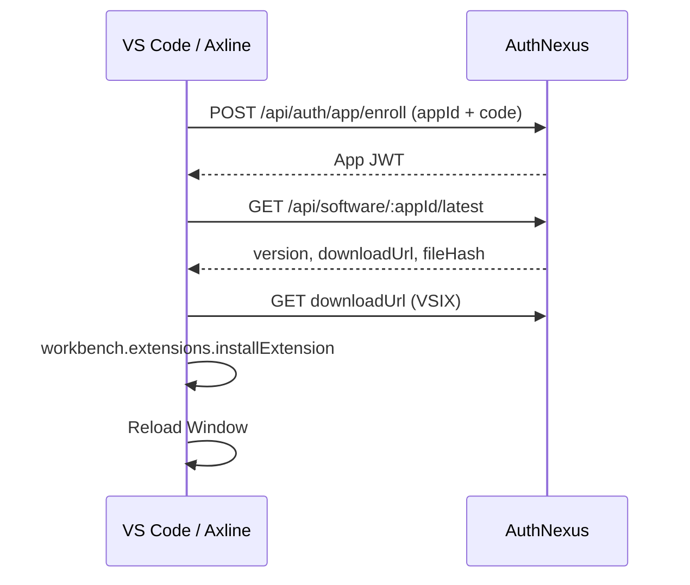

# Axline 私有更新（方案 A）

> **Version**: 0.2.0  
> **Updated**: 2026-07-15  
> **Status**: Implemented — extension + build/upload/verify scripts + SOP complete

## 概述

Axline 通过 **AuthNexus 软件发布 API** 检查私有服务器上的最新 VSIX，由扩展内轻量更新器完成下载与 `code --install-extension` 安装，不依赖 AxUpdater 的 in-place/NSIS 流程。

## 架构



## 配置

在 bundled 或 `~/.axline/endpoints.json` 中配置公开字段；`updateEnrollmentCode` 放 `~/.axline/secrets.json`：

```json
{
  "axgateBaseUrl": "https://auth.mtsilicon.com:6343",
  "authAppId": "app_uu1Sn7yC",
  "authNexusBaseUrl": "https://auth.mtsilicon.com",
  "updateAppId": "app_<AuthNexus软件应用ID>"
}
```

`~/.axline/secrets.json`：

```json
{
  "updateEnrollmentCode": "<Permanent安装码>",
  "authNexusAdminUser": "admin",
  "authNexusAdminPassword": "<控制台密码>"
}
```

环境变量覆盖（可选）：

| 变量 | 含义 |
|------|------|
| `AXLINE_AUTHNEXUS_BASE_URL` | AuthNexus 基址 |
| `AXLINE_UPDATE_APP_ID` | 软件发布 App ID |
| `AXLINE_UPDATE_ENROLLMENT_CODE` | Permanent enrollment code（优先于 endpoints.json，适合本机/CI 注入） |
| `AXLINE_NO_UPDATE_CHECK` | `1` 时禁用检查 |

VS Code 设置：

| 键 | 默认 | 说明 |
|----|------|------|
| `axline.update.autoCheck` | `true` | 启动与周期检查 |
| `axline.update.checkIntervalHours` | `24` | 检查间隔（小时） |

## AuthNexus 侧（运维）

完整 SOP：`.agent/project/sop/axline-private-update.md`

### 发布流程（摘要）

1. `bun apps/vscode/scripts/release-private-vsix.mjs` — 标准一键发布（推荐）
2. 或分步：`verify-versions` → `publish-private-vsix` → `add-endpoints-to-vsix` → `upload-private-vsix` → `verify-private-update`
3. AuthNexus STABLE 上传 **`axline-enterprise.vsix`**（内置公开 endpoints，必须为 ZIP）
4. `verify-private-update.mjs` 额外下载并校验 ZIP + SHA-256
5. 客户端门禁：**Check for Updates** → 安装 → Reload

### 凭据分工

| 凭据 | 用途 | 配置位置 |
|------|------|----------|
| Permanent enrollment code | 客户端检查更新（enroll） | `~/.axline/secrets.json` / `AXLINE_UPDATE_ENROLLMENT_CODE` |
| 管理员 username/password | 运维上传发布 | `~/.axline/secrets.json`（`authNexusAdminUser` / `authNexusAdminPassword`）；环境变量可覆盖 |

本机发布机一次性写入 `secrets.json` 后，AI Agent 应直接执行 `upload-private-vsix.mjs`，**勿**反复向用户索要管理员密码。

管理员登录需 `appId: authnexus-console`（`AUTHNEXUS_CONSOLE_APP_ID` 可覆盖）。

### 上传 API 注意

- 上传表单仅含 `file`、`version`、`track`、`changelog`、`isMandatory`
- **不要**在 API 请求中传 `fileHash`、`fileSize`、`status` — 服务端计算 hash；多传 `fileSize` 会触发 Prisma 500
- 新上传默认 `PENDING`；`upload-private-vsix.mjs` 会自动 promote 为 `PUBLISHED`

### 打包注意

- `endpoints.json` 仅用于本机脚本，**不得**存在于 `apps/vscode/` 打包时刻，否则 secrets 会进入 VSIX
- 企业重打包：`add-endpoints-to-vsix.mjs` 输出必须为 ZIP（`PK` 魔数）；Windows 禁止 `tar -cf *.vsix`
- 上传默认制品：`dist/axline-enterprise.vsix`（`upload-private-vsix.mjs` 自动选择）

参考：`AuthNexus/doc/CLIENT-API-SPEC.md`、`doc/operations/updater-release-validation.md`。  
Windows 重打包陷阱：`project/sop/enterprise-vsix-repack-pitfalls.md`。

## 扩展实现

| 模块 | 路径 |
|------|------|
| 配置解析 | `apps/vscode/src/services/update/config.ts` |
| AuthNexus 客户端 | `apps/vscode/src/services/update/authnexus-client.ts` |
| 更新编排 | `apps/vscode/src/services/update/axline-update-service.ts` |
| 命令 | `Axline: Check for Updates` (`axline.checkForUpdate`) |

App JWT 缓存：`~/.axline/update/authnexus-update.app-token.json`。

## 禁用场景

- `IS_DEV=true`（F5 调试）
- 未配置 `authNexusBaseUrl` + `updateAppId` + `updateEnrollmentCode`
- `axline.update.autoCheck=false`
- `AXLINE_NO_UPDATE_CHECK=1`

## 与 AxUpdater 的关系

- **版本源**：共用 AuthNexus Software Release。
- **执行器**：Axline 用 VS Code 扩展安装 API；桌面应用（WSync 等）继续用 AxUpdater。

## 测试覆盖

| 模块 | 测试文件 | 覆盖点 |
|------|----------|--------|
| `semver.ts` | `__tests__/semver.test.ts` | 版本比较、prerelease 忽略 |
| `config.ts` | `__tests__/config.test.ts` | 配置缺失/完整、环境变量优先 |
| `authnexus-client.ts` | `__tests__/authnexus-client.test.ts` | enroll、token 缓存、401 重试、SHA256 校验 |
| `axline-update-service.ts` | `__tests__/axline-update-service.test.ts` | 跳过条件、检查/安装/提示/手动检查/周期检查 |
| `config.ts` (endpoints) | `src/__tests__/config.test.ts` | 扩展字段解析与校验 |

运行：

```bash
cd apps/vscode
bun test src/services/update/__tests__/
```


### 代码与工具（已完成）

- [x] 扩展内 AuthNexus 客户端（enroll、latest、SHA256 校验）
- [x] VSIX 安装与 Reload 提示
- [x] 启动/周期检查 + `axline.checkForUpdate` 命令
- [x] `endpoints.example.json` 与配置解析测试
- [x] `publish-private-vsix.mjs` / `upload-private-vsix.mjs` / `verify-private-update.mjs`
- [x] `release-private-vsix.mjs` — 标准一键发布
- [x] `add-endpoints-to-vsix.mjs` + `lib/vsix-zip.mjs` — 企业重打包与 ZIP 校验
- [x] 运维 SOP：`project/sop/axline-private-update.md`

### 运维发布检查清单

- [ ] `verify-versions.mjs` 通过
- [ ] AuthNexus 已创建 Axline VSIX 软件应用（`updateAppId`）
- [ ] 已生成 Permanent enrollment code（`updateEnrollmentCode`，仅本机）
- [ ] `publish-private-vsix.mjs` 产出 `dist/axline.vsix`（打包时无 `endpoints.json`）
- [ ] `add-endpoints-to-vsix.mjs` 产出有效 ZIP 的 `dist/axline-enterprise.vsix`
- [ ] `upload-private-vsix.mjs` 上传 enterprise 制品且 status = `PUBLISHED`
- [ ] `verify-private-update.mjs`：`Download: OK (valid VSIX zip)` + `Integrity: OK`
- [ ] 客户端 **Check for Updates** → 安装 → Reload 版本一致
- [ ] （可选）更新 `version-state.toml`、`vscode/v*` tag、release note
